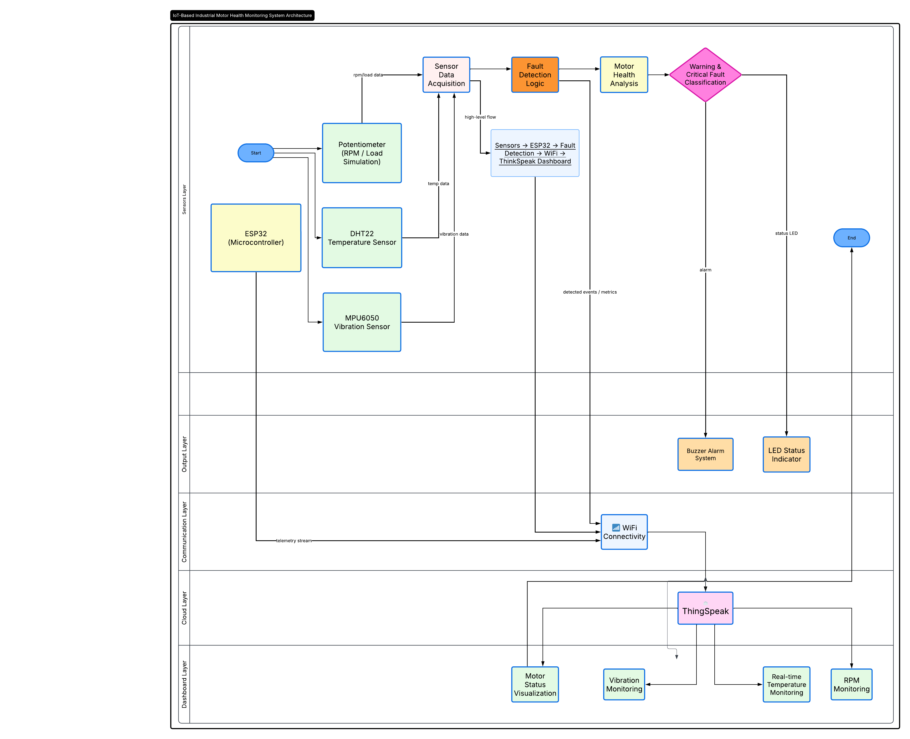
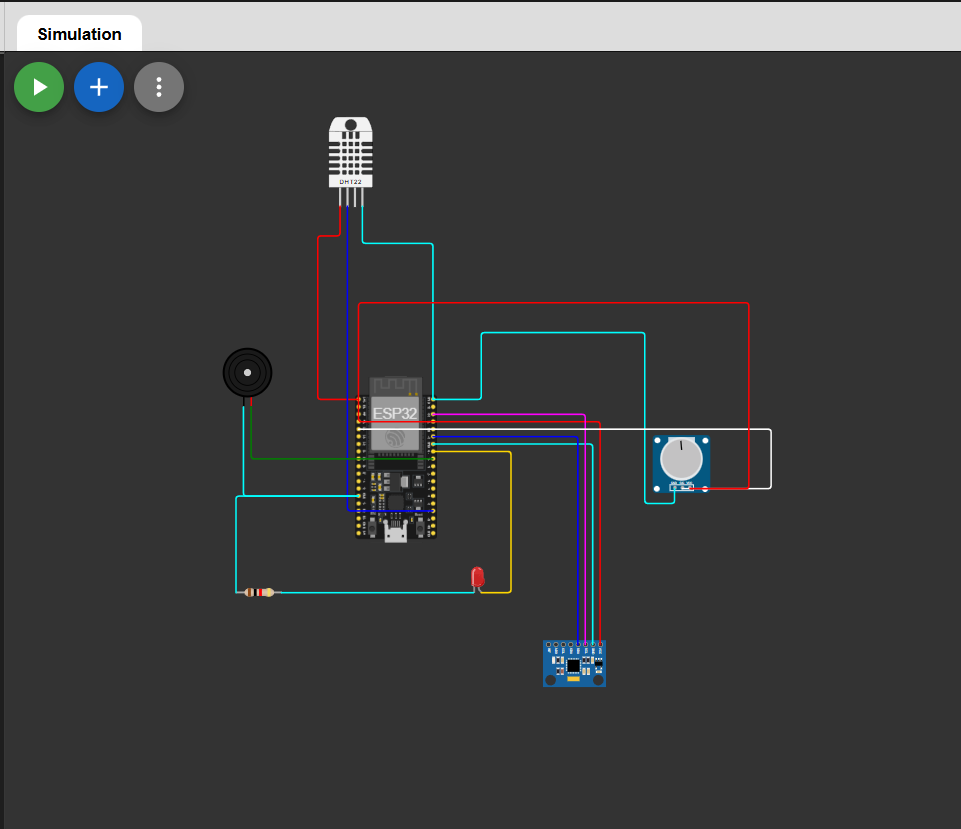
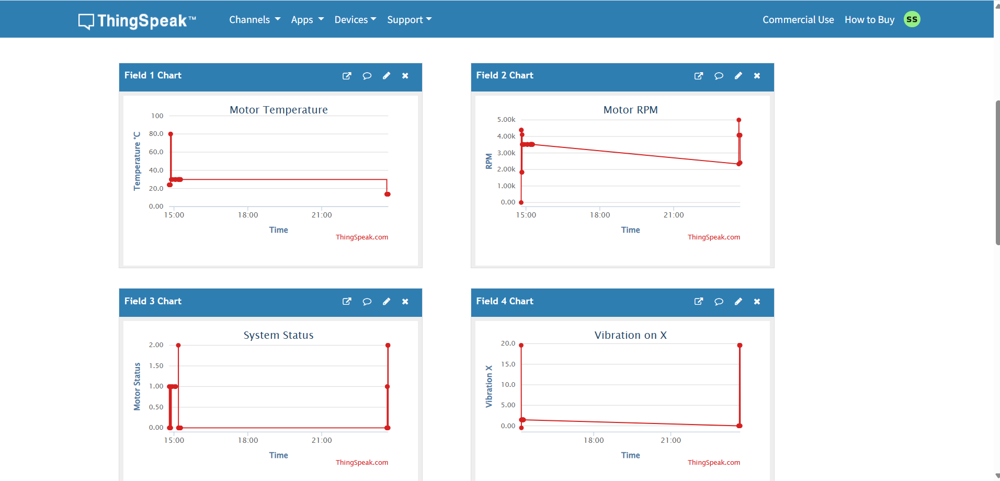

# IoT-Based Industrial Motor Health Monitoring System

## Overview

This project is an ESP32-based industrial motor monitoring system designed for predictive maintenance applications.

The system monitors:
- Motor temperature
- Vibration levels
- RPM/load conditions

Sensor data is processed by ESP32 and uploaded to the ThinkSpeak cloud platform for real-time visualization and monitoring.

---

## Features

- Real-time temperature monitoring
- Vibration analysis using MPU6050
- RPM/load simulation
- Warning and critical fault detection
- IoT cloud integration with ThinkSpeak
- LED and buzzer alert system
- Predictive maintenance-oriented logic

---

## Components Used

| Component | Purpose |
|---|---|
| ESP32 | Main controller |
| DHT22 | Temperature sensing |
| MPU6050 | Vibration monitoring |
| Potentiometer | RPM simulation |
| LED | Status indication |
| Buzzer | Alarm system |
| ThinkSpeak | Cloud dashboard |

---

## Working Principle

1. Sensors collect motor condition data.
2. ESP32 processes temperature, RPM and vibration values.
3. Fault detection logic classifies system condition.
4. Warning and critical alerts are generated.
5. Data is uploaded to ThinkSpeak cloud platform.
6. Dashboard displays real-time monitoring information.

---

## Technologies Used

- ESP32
- Embedded C++
- IoT
- ThinkSpeak
- Wokwi
- Sensor Interfacing

## System Architecture

## Circuit Design

## ThinkSpeak Dashboard

## Future Improvements

- AI-based anomaly detection
- MQTT communication
- PLC integration
- Mobile dashboard application
- Real motor integration

---
## Wokwi Simulation

https://wokwi.com/projects/465151341408266241

