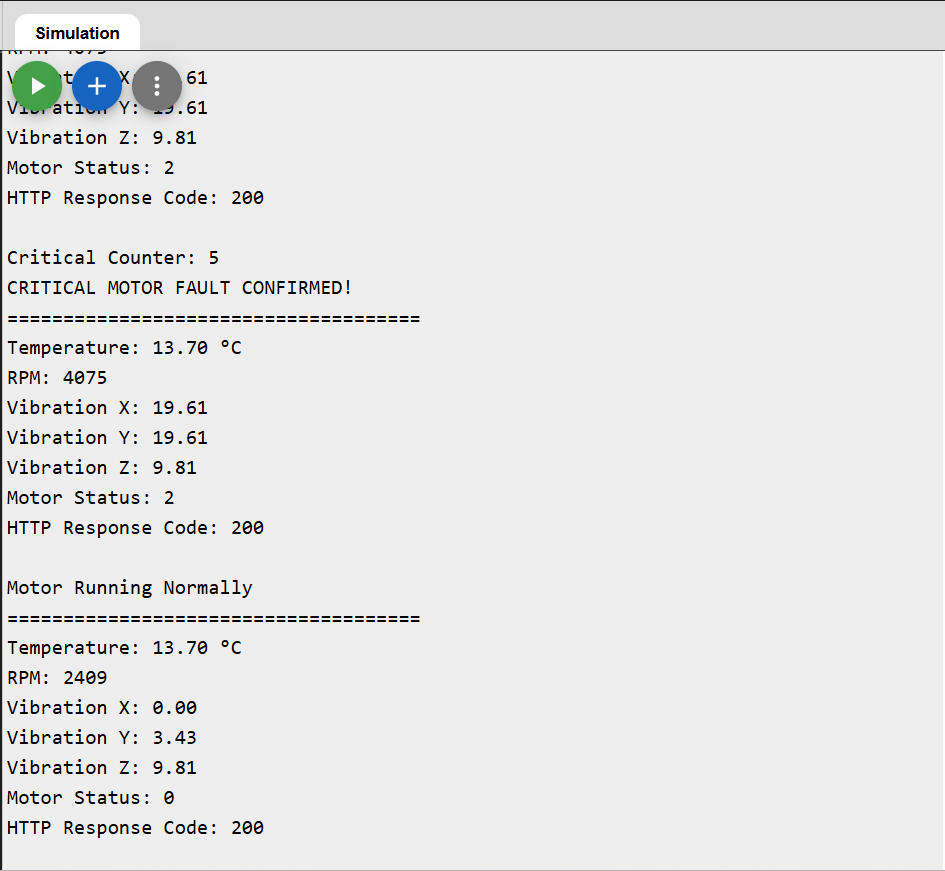

# IoT-Based Industrial Motor Health Monitoring System

## Overview

An ESP32-based predictive maintenance system that monitors industrial motor health in real time and pushes telemetry to the cloud. Validated end-to-end in Wokwi before hardware assembly.

The system monitors:
- Motor temperature (DHT22)
- Vibration across 3 axes (MPU6050)
- RPM / load condition (potentiometer-simulated)

---

## Key Design Details

- **Debounced fault detection**: a single bad reading doesn't trigger an alert. Warning and critical conditions each need **3 consecutive out-of-range cycles** (separate counters, reset on any healthy reading) before an alert fires — this avoids false positives from momentary sensor noise, a real concern with vibration/temperature sensors on live equipment.
- **Dual-threshold, 3-tier classification**: Normal / Warning / Critical states, with independent threshold pairs per sensor (temperature, vibration, RPM), fused into a single overall system state.
- **Cloud telemetry**: sensor data is pushed to ThingSpeak via HTTP GET every 15 seconds, with WiFi connection timeout/retry handling so the system degrades gracefully instead of hanging if the network drops.
- **LED + buzzer local alerting**, independent of cloud connectivity — the system still warns on-site even if WiFi is down.

---

## Components Used

| Component | Purpose |
|---|---|
| ESP32 | Main controller, WiFi + processing |
| DHT22 | Temperature sensing |
| MPU6050 | 3-axis vibration monitoring |
| Potentiometer | RPM/load simulation |
| LED | Local status indication |
| Buzzer | Local alarm |
| ThingSpeak | Cloud dashboard |

---

## Working Principle

1. Sensors collect temperature, vibration, and RPM data.
2. ESP32 evaluates each reading against warning/critical thresholds.
3. Debounce counters require 3 consecutive out-of-range cycles before state changes — filters sensor noise.
4. Overall system state (Normal/Warning/Critical) drives local LED/buzzer alerts.
5. Data is pushed to ThingSpeak every 15s via HTTP GET.
6. Dashboard displays real-time monitoring information.

---

## Technologies Used

ESP32 · Embedded C++ · IoT · ThingSpeak · Wokwi · Sensor Interfacing

---

## System Architecture


## Circuit Design


## ThingSpeak Dashboard


## Serial Monitor Output



---

## Repo Structure

```
motor_monitoring_system.ino   Main ESP32 firmware
media/                        Circuit diagram, architecture diagram, dashboard + serial monitor screenshots
docs/                         Flow diagram (PDF)
wokwi-simulation/             Wokwi project export (circuit validated before hardware build)
```

## Setup

1. Open `motor_monitoring_system.ino` in the Arduino IDE (with ESP32 board support installed).
2. Replace the WiFi SSID/password placeholders with your network credentials.
3. Get a ThingSpeak Write API Key from [thingspeak.com](https://thingspeak.com) (create a channel first) and replace the `apiKey` placeholder in the code.
4. Flash to an ESP32, or import `wokwi-simulation/wokwi_export.zip` into [Wokwi](https://wokwi.com) to simulate first.

**Note:** never commit a real API key to a public repo — keep it as a placeholder in version control and set it locally when flashing.

---

## Future Improvements

- AI-based anomaly detection
- MQTT communication
- PLC integration
- Mobile dashboard application
- Real motor integration (currently simulated via potentiometer)

---

## Links

- **Wokwi Simulation**: https://wokwi.com/projects/465151341408266241
- **Demo Video**: https://youtu.be/BxB7_B8NXfs
